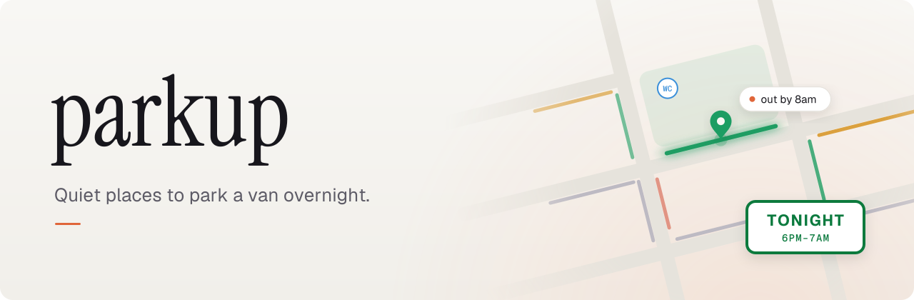
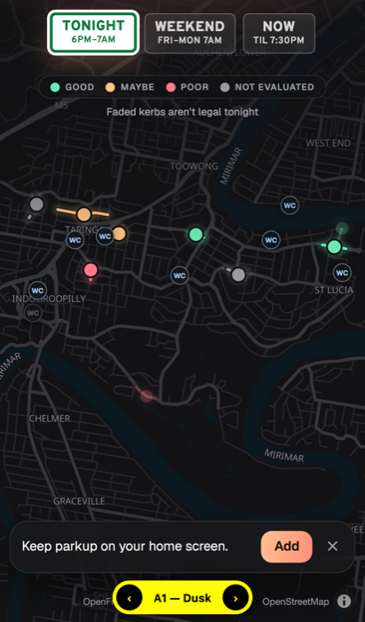
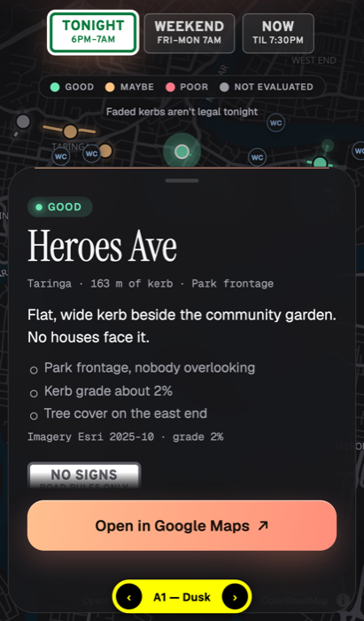
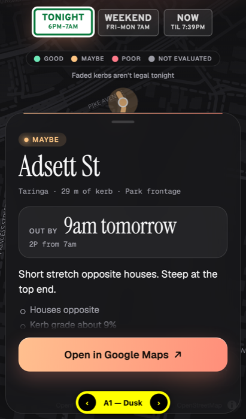

<picture>
  <source media="(prefers-color-scheme: dark)" srcset="docs/img/banner-dark.svg">
  
</picture>

  

&nbsp;&nbsp;
&nbsp;&nbsp;

Prototype screens

parkup combines Brisbane City Council's parking-sign data with OpenStreetMap to find kerbs and car parks where you can legally stay the night. It then ranks them by how secluded they look from overhead imagery. Pick **Tonight**, **Weekend** or **Now**, tap a spot to see when you'd have to move and where the nearest toilet is, then open it in Google Maps to check it and save it.

It runs as a static site on GitHub Pages. Imagery is evaluated offline beforehand, so the app needs no account or API key.

> [!WARNING]
> A first screen, not legal advice. Always check the signs on arrival.

**Status:** in development. [Open the app](https://xdgfx.github.io/parkup/), or see the [spec and build tickets](https://github.com/XDGFX/parkup/issues/14).

## Development

### Commands

| Command | What it does |
|---|---|
| `npm run snapshot` | Fetches BCC parking signs and OSM centrelines into `data/snapshot/` (committed). |
| `npm run build:data` | Snapshot to candidates: writes `public/candidates.json` and `data/build-report.{md,json}`. Add `-- --snapshot` to take a fresh snapshot first. |
| `npm run dev` | Runs the app locally. |
| `npm test` | Timetable (seam 1) and build (seam 2) tests. |
| `npm run typecheck` | TypeScript check. |

The app deploys to GitHub Pages from `main`.

### Layout

- `src/timetable/` — the weekly timetable, `statusAt`, `outBy`, `canStay` and the Tonight, Weekend and Now presets, in Brisbane time. Shared by the build and the app.
- `src/build/` — snapshot, plate parser, kerb-stretch builder, screen and the build entry point. Thresholds live in `config.ts`.
- `src/app/` — the MapLibre app (layout A1, Dusk).

Data: Brisbane City Council and Queensland Government (CC BY 4.0), © OpenStreetMap contributors (ODbL), National Public Toilet Map.
