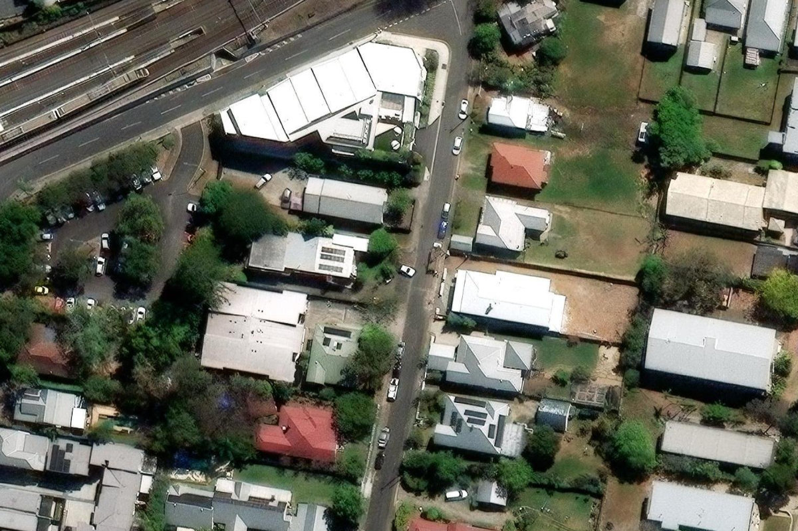
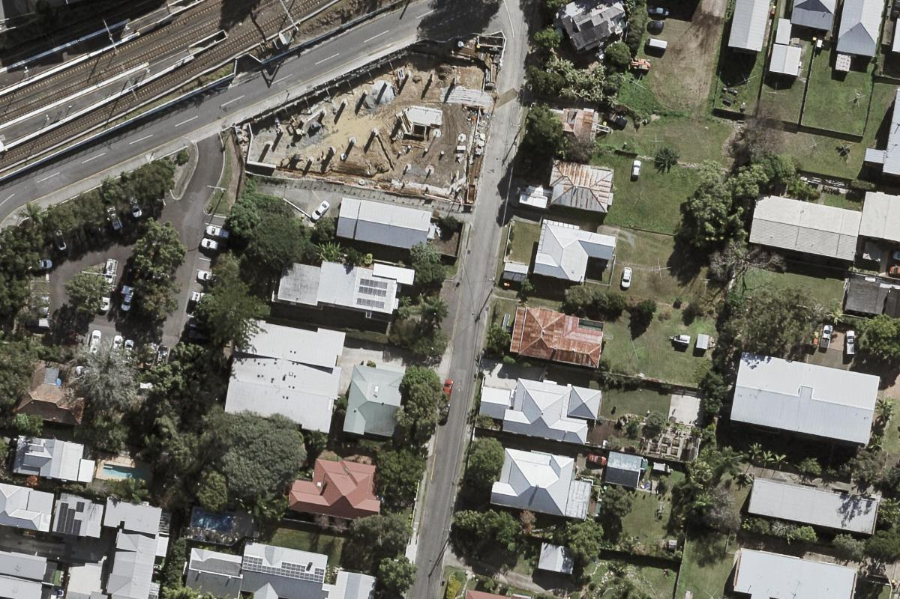

# Imagery: overhead vs Street View

Research for [#4](https://github.com/XDGFX/parkup/issues/4). Tested on 30 September 2026 over Taringa (around -27.4934, 152.9830), Indooroopilly (-27.4990, 152.9730) and St Lucia (-27.4980, 153.0000).

## Answer

- **Default overhead source: Esri World Imagery.** No key is needed. It is recent (Vantor satellite, September–November 2025, about 30 cm native) and gives a per-point capture date through its own query layers.
- **Detail source: Queensland Latest State Program.** No key is needed and it's CC BY 4.0. It is sharper (10 cm aerial), but the newest public capture over Brisbane is July–September 2022, because State aerials become public only after three years.
- **Slope: Queensland DEM (`Elevation/QldDem`).** It needs no key and measures along-kerb grade directly. Slope is the main thing people expect Street View to supply, and the DEM covers it without Street View.
- **Street View: optional, not in v1.** Its date is known for free through the metadata endpoint. It adds kerb profile, crossfall, lighting and how overlooked a spot feels, but only a person checking a candidate in the Google Maps app needs those, and that check is free. Automated calls need a billed Google Cloud project. Google's terms forbid caching the images and make stored AI evaluations of them a grey area.
- **Before any bulk agent run**, get a free ArcGIS Location Platform key. Esri's terms require an account even though keyless export works.

## Overhead sources

| Source | Native resolution (Taringa, Indooroopilly, St Lucia) | Capture date | Key / cost | Terms |
|---|---|---|---|---|
| Esri World Imagery | 0.31–0.34 m satellite (WV03, LG02/LG03). Level 20 is resampled to 0.15 m | 2025-09-24 (level 20); 2025-11-17 (Taringa, St Lucia) and 2025-11-30 (Indooroopilly) for levels 12–19 | Keyless `export` works, but Esri requires an account. 2M basemap tiles free a month | Esri Master License Agreement; see Esri below |
| QLD Latest State Program (QImagery / Queensland Globe) | 0.10 m aerial (`Brisbane_LGA_2022_10cm_SISP`) | 2022-07-24 to 2022-09-12 | None | CC BY 4.0 |
| QLD TimeSeries AerialOrtho | 0.10 m, yearly Brisbane captures 2011–2022 | Per-capture `capturestart`/`captureend` | None | CC BY 4.0 |
| Google satellite (Static Maps / Map Tiles) | Not tested (no key). Static Maps is at most 640×640 (1280 at scale=2) | None exposed: Map Tiles viewport info returns only `copyright` and `maxZoomRects` ([2D tiles](https://developers.google.com/maps/documentation/tile/2d-tiles-overview)) | Key plus Cloud project. Static Maps: 10k free a month, then US$2 per 1k. Map Tiles: 100k free, then US$0.60 per 1k ([pricing](https://developers.google.com/maps/billing-and-pricing/pricing)) | No caching. No scraping or bulk download ([ToS §3.2.3](https://cloud.google.com/maps-platform/terms)) |
| Nearmap | 5.5–7.5 cm GSD; Australia is flown 1–6 times a year ([Nearmap](https://www.nearmap.com/au/blog/high-resolution-aerial-imagery-coverage)). Brisbane cadence not published | Per survey | Subscription only; no free API tier ([APIs](https://www.nearmap.com/au/products/integrations-apis)) | Commercial; out of reach for parkup |

### Esri World Imagery

- The export request works without a key. Tested with `.../World_Imagery/MapServer/export?bbox=...&bboxSR=4326&imageSR=3857&size=1200,800&format=jpg&f=image`.
- Capture dates come from the service itself. Its [layer list](https://server.arcgisonline.com/ArcGIS/rest/services/World_Imagery/MapServer?f=json) includes queryable polygon layers: `4 Citations`, and one metadata layer for each resolution band from `5` (1.9 cm) to `18` (150 m). A point query returns `SRC_DATE`, `SRC_RES`, `SRC_DESC` (sensor), `NICE_DESC` (provider) and `MinMapLevel`/`MaxMapLevel`:

  ```
  https://server.arcgisonline.com/ArcGIS/rest/services/World_Imagery/MapServer/4/query?geometry=152.9830,-27.4934&geometryType=esriGeometryPoint&inSR=4326&spatialRel=esriSpatialRelIntersects&outFields=*&returnGeometry=false&f=json
  ```

  Over all three suburbs, the metadata layers for 1.9 cm, 3.7 cm and 7.5 cm (5–7) return nothing. The 15 cm layer (8) returns WorldView-3 from 2025-09-24, with `SAMP_RES` 0.15 but `SRC_RES` 0.31. The 30 cm layer (9) returns Vantor "Vivid Advanced" from November 2025. The data is recent, but every pixel is resampled satellite imagery at about 30 cm.
- To choose the date layer, use the zoom level the agent renders at: level 20 for 15 cm and levels 12–19 for 30 cm.
- On terms, the [World Imagery item](https://www.arcgis.com/sharing/rest/content/items/10df2279f9684e4a9f6a7f08febac2a9?f=json) says it is "licensed under the Esri Master License Agreement". It adds that "this layer is not intended to be used to export tiles for offline" use. Esri's developer docs say "an ArcGIS Location Platform or ArcGIS Online account is required to use the services" ([security and authentication](https://developers.arcgis.com/documentation/security-and-authentication/)). Keyless `export` works in practice, but it isn't the sanctioned route. The sanctioned route is a free Location Platform key, where basemap tiles cost "2M free then $0.15 per 1,000 tiles" ([pricing](https://location.arcgis.com/pricing/)). Plan on getting a key before any agent runs in bulk.

### Queensland imagery (QImagery / Queensland Globe back end)

- There is a public ArcGIS server at [`spatial-img.information.qld.gov.au`](https://spatial-img.information.qld.gov.au/arcgis/rest/services?f=json). The useful services are `Basemaps/LatestStateProgram_AllUsers`, `TimeSeries/AerialOrtho_AllUsers` and `Elevation/QldDem`.
- The [service description](https://spatial-img.information.qld.gov.au/arcgis/rest/services/Basemaps/LatestStateProgram_AllUsers/ImageServer?f=json) says State aerial imagery "that is three years or older ... is made available for public use openly". Newer SISP captures need a restricted service, so the public copy always lags by at least three years.
- A catalogue query (`ImageServer/query?geometry=<lon,lat>&...&outFields=name,year,capturestart,captureend,res_value`) returns capture windows. All three suburbs fall in `Brisbane_LGA_2022_10cm_SISP`: 10 cm, 24 July to 12 September 2022. The TimeSeries service goes back year by year to 2011.
- `exportImage` works without a key and allows up to 7680 px on a side (`maxImageWidth`).
- Licence: CC BY 4.0, per the [data.qld.gov.au record](https://www.data.qld.gov.au/dataset/queensland-imagery-latest-state-program-public-basemap-service). The attribution string is in the service's `copyrightText`.

### Side by side, Taringa

The same 200 m × 130 m box at about 0.17 m per pixel (`bbox=152.9820,-27.4940,152.9840,-27.4928`):

| Esri, late 2025 | QLD, winter 2022 |
|---|---|
|  |  |

In the 2022 aerial, the corner block by the railway is a building site. By 2025 it is a finished building, and a house on the east side has been replaced. Both images show parked cars, driveway crossovers, kerb lines and tree canopy clearly enough to work with. The QLD image is visibly sharper: line markings and the road edge are crisper, and it has less haze. Use Esri to judge what is there now and QLD to read detail, and let the agent weigh the gap between their dates.

### Slope without Street View

`Elevation/QldDem/ImageServer/identify` works without a key. Its service pixel is 0.5 m, though the resolution of the underlying LiDAR at this location was not confirmed. Two points about 120 m apart on the Taringa test street returned 16.27 m and 32.37 m, a grade of about 13%. Sampling the DEM every few metres along a kerb stretch answers "is it flat enough to sleep on" better than a Street View photo does.

## Street View

- **Cost.** Street View Static is an Essentials SKU: 10,000 free requests a month, then US$7.00 per 1,000 up to 100k ([pricing](https://developers.google.com/maps/billing-and-pricing/pricing)). A few hundred candidates would stay inside the free cap.
- **Capture date.** The [metadata endpoint](https://developers.google.com/maps/documentation/streetview/metadata) is "available at no charge. No quota is consumed when you request metadata." It returns `status`, `date`, `location`, `pano_id` and `copyright`. The `date` field can be `YYYY-MM` or only `YYYY`, and it is left out when unknown. That makes a staleness check cheap: fetch metadata first, and skip the image if the panorama is too old.
- **Setup.** An API key is required ([key setup](https://developers.google.com/maps/documentation/streetview/get-api-key)). That means a Google Cloud project with the Street View Static API enabled and a billing account attached. Google Maps Platform keys are issued "for authentication and billing purposes", although the docs pages checked here never state outright that billing must be enabled.
- **Terms** ([Maps Platform ToS §3.2.3](https://cloud.google.com/maps-platform/terms)):
  - "Customer will not cache Google Maps Content except as expressly permitted". The [Service Specific Terms](https://cloud.google.com/maps-platform/terms/maps-service-terms) allow caching only the `pano_id` for Street View Static, so images must not be kept.
  - No bulk download of "Street View images".
  - No "create content based on Google Maps Content", and the example given is building an index "from Street View imagery".
  - No using content "to improve machine learning and artificial intelligence models, including to train, test, validate or fine-tune".
  - Street View must not be shown "and non-Google Maps on the same screen". parkup's map (#1) is not Google.
- **Reading the terms.** An agent looking at an image to judge a spot is inference, not training. A stored evaluation drawn from Street View is arguably "content based on Google Maps Content", though. That is grey, not clearly allowed. If Street View is used, keep the `pano_id` and date and not the image, and don't show Street View next to a non-Google map in the app. Linking out to Google Maps is fine.
- **How old it is.** Not measured, because no key was available. The date is one free metadata call per candidate once a key exists.

## What Street View adds for judging a kerb

Checking signs is out of scope, since the council sign data is newer. Beyond that:

| Question | Overhead + DEM | Street View |
|---|---|---|
| Driveway crossovers, room for a van between them | Good (crossovers and parked cars are visible at 10–30 cm) | Confirms |
| Ground slope along the kerb | Good (DEM) | Qualitative only |
| Road crossfall and camber toward the kerb | No | Yes. This is the main thing it adds for sleeping comfort |
| Kerb type (barrier vs mountable, grass verge vs concrete) | Partly | Yes |
| Overhanging branches and height clearance | Canopy extent only | Yes, clearance height |
| Street lighting | Poles are sometimes visible, but not whether they are lit | Lanterns are visible. Not whether they are lit or how bright at night |
| Exposure: houses facing the kerb, windows, how overlooked it feels | Frontage and building layout | Yes. The best qualitative signal it gives |
| Current state (new building, works) | Esri is 2025 | Often older. The date is known from metadata |

Verdict: Street View tells an agent about crossfall, kerb profile, clearance and how overlooked a spot is. Those are real factors for a van, but they are second-order once slope, frontage and gaps between driveways are known. They also don't change whether a spot is legal. The user will open the spot in Google Maps before saving it as a park-up anyway, and that human check covers Street View for free. Add it to evaluations only if early candidates keep failing on crossfall or exposure.

## Couldn't confirm

- Actual Street View capture dates on these streets: no Google API key was available to call the metadata endpoint.
- The native LiDAR resolution behind `QldDem` here, and the DEM's licence (probably CC BY 4.0, like the imagery; not checked).
- The exact wording of the Esri Master License Agreement on automated analysis. It wasn't read, only the developer docs' account requirement.
- Brisbane-specific Nearmap capture cadence.
- Google satellite resolution over these suburbs. It wasn't tested, since no key was available.
