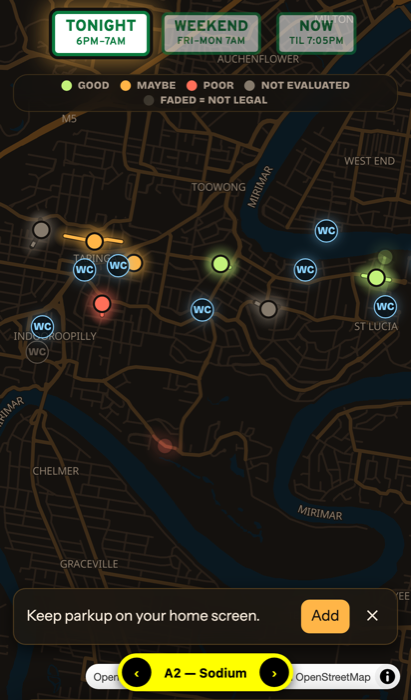
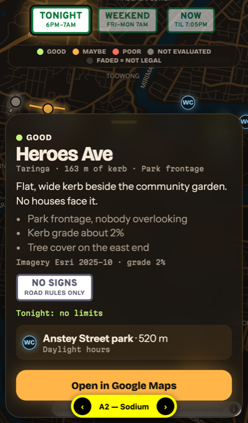
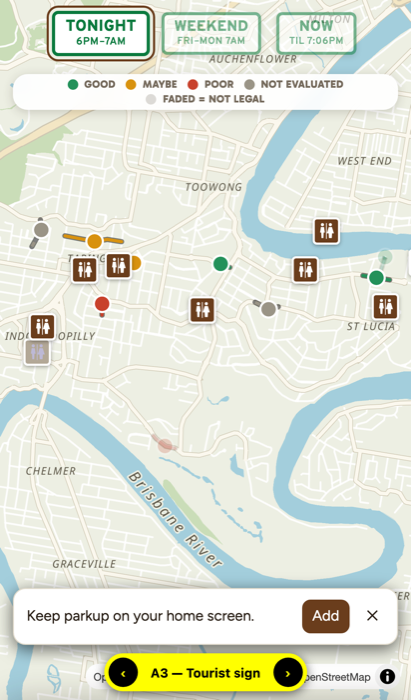
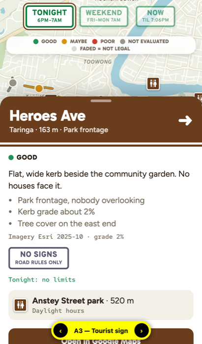
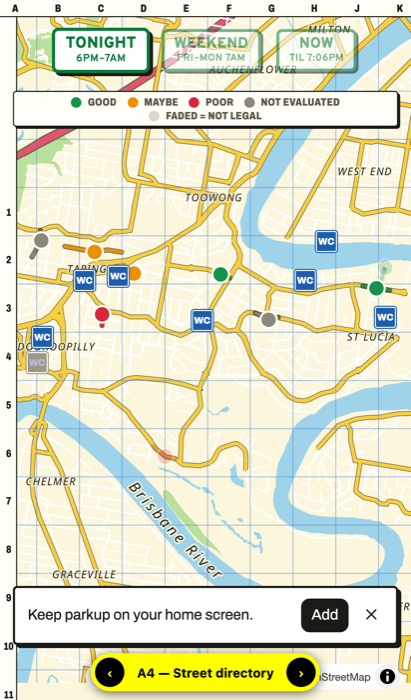
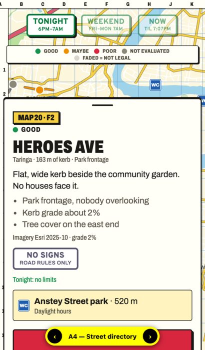
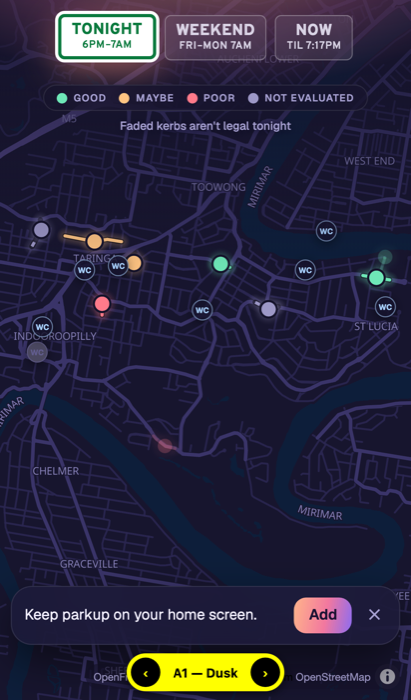
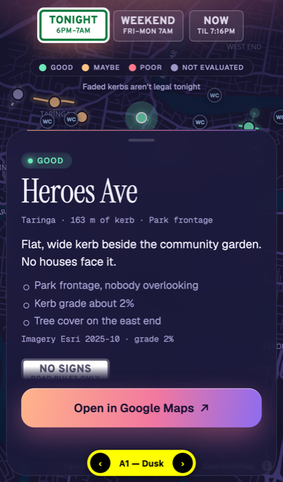

# App UI prototype (throwaway)

A phone mock-up for [#7 App UI](https://github.com/XDGFX/parkup/issues/7), built on placeholder data. It isn't the app. Keep it off `main`.

Run from a checkout of the `worktree-7-app-ui` branch. `main` has no `prototype/` folder, so the server would 404.

```sh
python3 -m http.server 8000 -d prototype/app-ui
# open http://localhost:8000/?variant=A  (or B, C). The yellow pill and ← → cycle variants.
```

To try it on a phone, run the server with `--bind 0.0.0.0` and open `http://<laptop-ip>:8000` on the same Wi-Fi. Install only works over HTTPS, e.g. GitHub Pages.

## What's real and what's invented

- **Kerb lines:** real OSM road centrelines offset 5 m to one side, from `make_data.py`.
- **Toilet positions:** real OSM `amenity=toilets` nodes.
- **Invented:** sign rules, frontage, evaluations, toilet names and opening hours.

## The three variants

| | A — Map and sheet | B — List first | C — Week clock |
|---|---|---|---|
| Base tiles | OpenFreeMap *dark* (vector) | OpenFreeMap *liberty* (vector) | OpenFreeMap *positron* + Esri imagery toggle |
| Time window | Three sign plates: Tonight, Weekend, Now | Segmented control | Drag through a 7-day × 24-hour strip |
| Candidates drawn as | Dots → kerb lines at street zoom, coloured by **evaluation**; faded when not legal in the window | Dots coloured by **legal window**; illegal ones hidden | Dots/lines coloured by **legality at the chosen hour**, ring = evaluation |
| Candidate card | Bottom sheet over the map | Inline expanding list row, ranked by evaluation | Full page with an Esri imagery crop and a week grid |
| Toilets | Always shown | Off by default, toggle | Always shown, greyed when closed at the chosen hour |
| Home screen | Dismissible banner | "⋯" menu entry | Manifest only, no prompt |

All three use MapLibre GL JS and share the manifest, the icon and the "Open in Google Maps" link (`maps/search/?api=1&query=lat,lon`).

Screenshots (iPhone 13 size, headless Chromium) are in `img/`.

| A map | A sheet | B list | C clock | C card |
|---|---|---|---|---|
|  |  |  |  |  |

## Visual themes for layout A

Layout A won the first round. The second round kept its layout and tried four looks (palette, type, a recoloured base map, and one signature touch each). The first cut of Dusk is now `A0`. The parking-plate buttons stay in the road-sign face (Overpass) in every theme.

| | Look | Type | Signature |
|---|---|---|---|
| A0 Dusk, first cut | The first round's solid indigo | Overpass / Atkinson Hyperlegible | Parking plates |
| A2 Sodium | Night drive: warm black map, frosted-glass panels, amber accent | Bricolage Grotesque / Instrument Sans / Martian Mono | Kerbs glow like pools of streetlight |
| A3 Tourist sign | Daytime: soft eucalypt map, white cards | Gabarito / Figtree / Red Hat Mono | Brown tourist-sign header on the sheet, brown toilet pictogram pins |
| A4 Street directory | A 90s paper street directory: yellow and red roads, printed cards with hard shadows | Archivo at several widths | Grid rulers on the map edges and a grid reference on each card ("Map 20 · F2") |

| A2 map | A2 sheet | A3 map | A3 sheet | A4 map | A4 sheet |
|---|---|---|---|---|---|
|  |  |  |  |  |  |

### Round 3: Dusk refined (`?variant=A1`)

Dusk won. `A1` is now the refined version and `A0` is the first cut, for comparison. The arrows cycle these two; A2–A4, B and C stay reachable by URL.

- **No purple.** The first cut's solid indigo was the complaint, so the chrome and map are neutral graphite and translucent glass. The only warm colour is a faint sunset glow behind the window signs, reused on the Google Maps button and a thin line along the top of the sheet.
- **Map:** OpenFreeMap *dark*, recoloured to near-neutral graphite with a hint of cool water. Candidates glow softly; toilet pins are small and quiet so candidates stand out.
- **Signs:** only the chosen window is a full white parking plate; the others are outlined glass.
- **Sheet:** a floating frosted-glass card with a rounded top.
  - The street name is set in Instrument Serif; body text is Geist and data is Geist Mono.
  - The verdict is a tinted pill.
  - The Google Maps button stays pinned at the bottom while the body scrolls and fades out at both edges.
- **Motion:** the sky fades in and the signs drop in once on load. The sheet opens with a slight spring, and a soft pulsing ring marks the chosen candidate. Reduced motion turns these off.
- **Colours:** mint, peach and coral for good, maybe and poor; grey for not evaluated.

Approved. The card also shows when you'd have to move if you parked at the start of the window: "Out by 9am tomorrow · 2P from 7am". A limit counts from when it starts applying, so a 2P 6am–6pm sign means out by 8am after a night there. The time turns peach when it falls before the window ends, e.g. Keith St's 5am on a Tonight window that runs to 7am. `outby.check.mjs` holds the cases (`node prototype/app-ui/outby.check.mjs`).

| A1 map | A1 sheet | Out by |
|---|---|---|
|  |  |  |

## Proposed answers (for the user to confirm)

- **Map library and tiles:** MapLibre GL JS with OpenFreeMap vector tiles. There's no key and no quota, and it gives smooth pinch-zoom. Esri World Imagery works as a keyless raster toggle, so you can see the same imagery the evaluation saw. Leaflet would also work but has no vector tiles.
- **Time window:** A's three presets (Tonight, Weekend, Now) cover the common case with one tap. C's week strip is the only one that answers "when do I have to move?", so keep it as the card's week grid rather than the main control.
- **Candidates:** show dots at suburb zoom and kerb lines from street zoom. A line alone is invisible on a phone at suburb zoom; compare `img/lines-only.png` with `img/a-map.png`. Colour by **evaluation** and fade out ones that aren't legal in the chosen window. Legality then filters, and evaluation ranks.
- **Card:** A's bottom sheet, borrowing C's sign plates, imagery crop and week grid when the sheet is pulled up. Keep "Open in Google Maps" as the only action.
- **Toilets:** always on, greyed when closed at the start of the chosen window (A) or the chosen hour (C). Opening hours are free text, so the real app needs a small parser and a "hours unknown" state.
- **Home screen:** a web manifest plus an `apple-touch-icon` PNG, since iOS ignores SVG icons. Show a one-time banner: Android Chrome fires `beforeinstallprompt`, and iOS needs the "Share → Add to Home Screen" hint. The banner must hide behind the sheet. No service worker until offline use is specified.

## Things the mock-up surfaced for the real app

- **A fixed window end hides good kerbs.** Keith St has "No parking 5–7am" but is fine overnight if you leave by 5am. The card now says "Out by 5am", but the map still fades Keith St because Tonight runs to 7am. The real app should decide whether fading follows the window end or a minimum stay.
- **Time limits need the window's length.** A 2P kerb is legal for "Now" only if the limited part of the window is 2 hours or less. The prototype reads the hours from the plate's label (`2P` → 2 h); the real kerb-stretch model should store them.
- **Time zone.** The prototype uses the phone's clock. The real app should work in `Australia/Brisbane`, whatever zone the phone is in.
- **Card pin position.** The Google Maps link drops a pin at the kerb line's middle vertex. The real app should use the point halfway along the line. Saving it to the park-up list is still a manual step in Google Maps.
