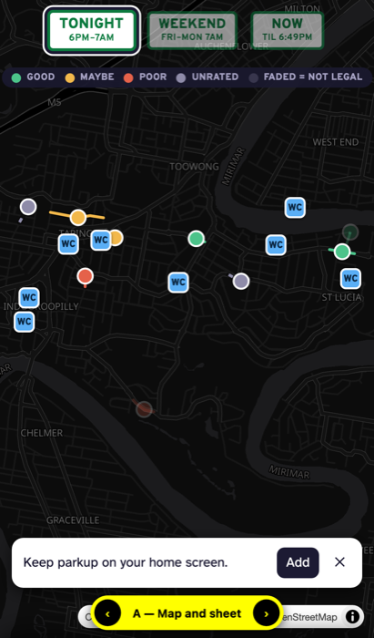
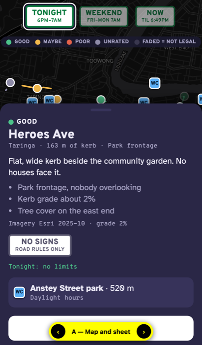
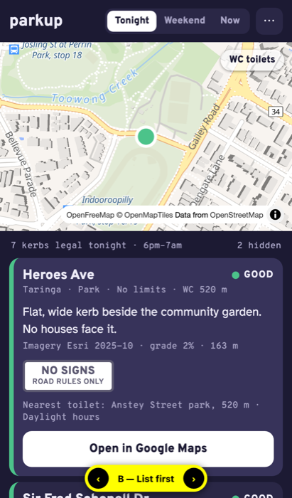
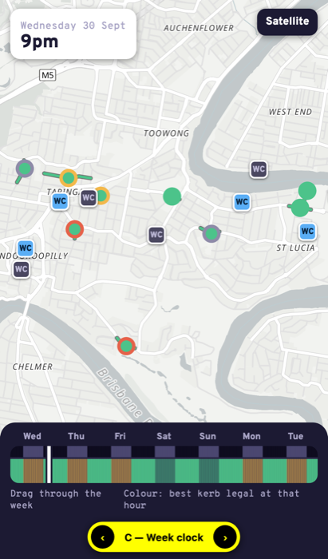
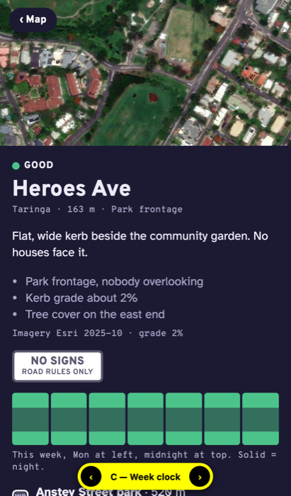

# App UI prototype (throwaway)

A phone mock-up for [#7 App UI](https://github.com/XDGFX/parkup/issues/7), built on placeholder data. It isn't the app. Keep it off `main`.

```sh
python3 -m http.server 8000 -d prototype/app-ui
# open http://localhost:8000/?variant=A  (or B, C). The yellow pill and ← → cycle variants.
```

To try it on a phone, run the server with `--bind 0.0.0.0` and open `http://<laptop-ip>:8000` on the same Wi-Fi. Install only works over HTTPS, e.g. GitHub Pages.

## What's real and what's invented

- **Kerb lines:** real OSM road centrelines offset 5 m to one side, from `make_data.py`.
- **Toilet positions:** real OSM `amenity=toilets` nodes.
- **Invented:** sign rules, frontage, evaluations, toilet names and opening hours.

## The three variants

| | A — Map and sheet | B — List first | C — Week clock |
|---|---|---|---|
| Base tiles | OpenFreeMap *dark* (vector) | OpenFreeMap *liberty* (vector) | OpenFreeMap *positron* + Esri imagery toggle |
| Time window | Three sign plates: Tonight, Weekend, Now | Segmented control | Drag through a 7-day × 24-hour strip |
| Candidates drawn as | Dots → kerb lines at street zoom, coloured by **evaluation**; faded when not legal in the window | Dots coloured by **legal window**; illegal ones hidden | Dots/lines coloured by **legality at the chosen hour**, ring = evaluation |
| Candidate card | Bottom sheet over the map | Inline expanding list row, ranked by evaluation | Full page with an Esri imagery crop and a week grid |
| Toilets | Always shown | Off by default, toggle | Always shown, greyed when closed at the chosen hour |
| Home screen | Dismissible banner | "⋯" menu entry | Manifest only, no prompt |

All three use MapLibre GL JS and share the manifest, the icon and the "Open in Google Maps" link (`maps/search/?api=1&query=lat,lon`).

Screenshots (iPhone 13 size, headless Chromium) are in `img/`.

| A map | A sheet | B list | C clock | C card |
|---|---|---|---|---|
|  |  |  |  |  |

## Proposed answers (for the user to confirm)

- **Map library and tiles:** MapLibre GL JS with OpenFreeMap vector tiles. There's no key and no quota, and it gives smooth pinch-zoom. Esri World Imagery works as a keyless raster toggle, so you can see the same imagery the evaluation saw. Leaflet would also work but has no vector tiles.
- **Time window:** A's three presets (Tonight, Weekend, Now) cover the common case with one tap. C's week strip is the only one that answers "when do I have to move?", so keep it as the card's week grid rather than the main control.
- **Candidates:** show dots at suburb zoom and kerb lines from street zoom. A line alone is invisible on a phone at suburb zoom; compare `img/lines-only.png` with `img/a-map.png`. Colour by **evaluation** and fade out ones that aren't legal in the chosen window. Legality then filters, and evaluation ranks.
- **Card:** A's bottom sheet, borrowing C's sign plates, imagery crop and week grid when the sheet is pulled up. Keep "Open in Google Maps" as the only action.
- **Toilets:** always on, greyed when closed during the chosen window. Opening hours are free text, so the real app needs a small parser and a "hours unknown" state.
- **Home screen:** a web manifest plus an `apple-touch-icon` PNG, since iOS ignores SVG icons. Show a one-time banner: Android Chrome fires `beforeinstallprompt`, and iOS needs the "Share → Add to Home Screen" hint. The banner must hide behind the sheet. No service worker until offline use is specified.
